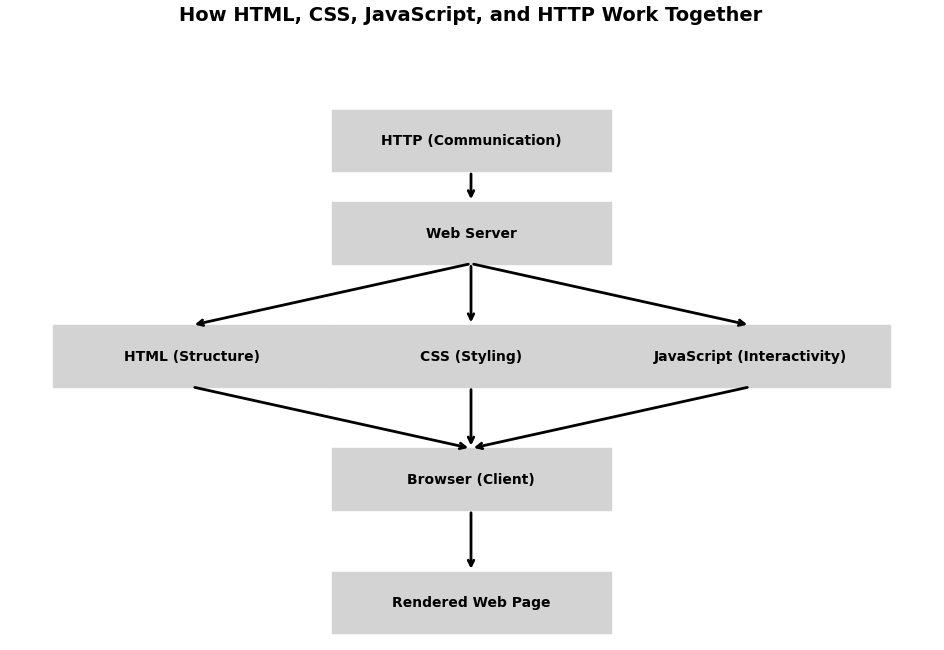
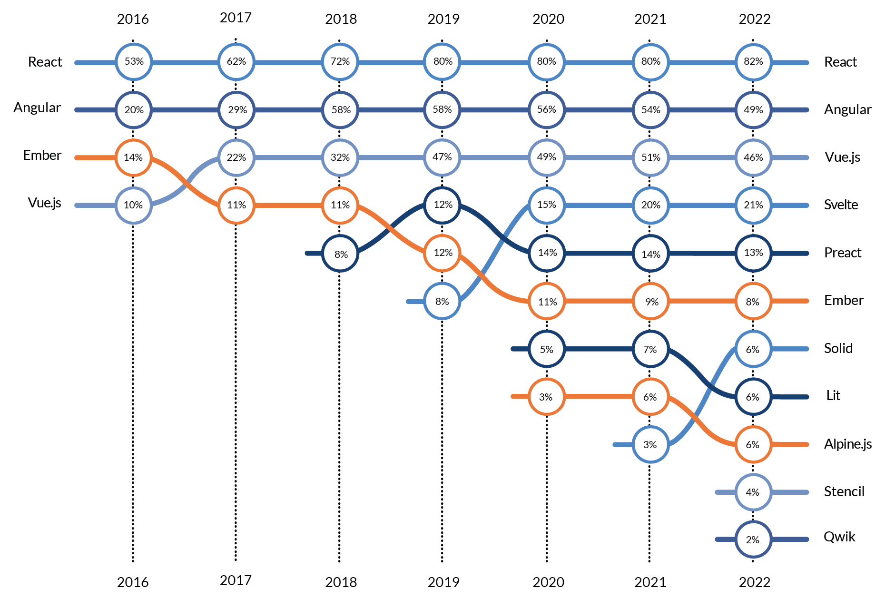
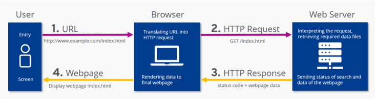

# 1 Introduction to Web Technologies

This module provides a high-level overview of the various technologies in the web application stack, their roles, and how they interrelate. 


## Legacy Web Stack

The fundamental legacy web technologies — HTML, CSS, JavaScript, and HTTP — work in unison to create modern web pages:
- **HTML** forms the structure of the page.
- **CSS** styles the visual appearance.
- **JavaScript** enables dynamic functionality and interactivity.
- **HTTP** facilitates communication between the browser (client) and the web server.



Interaction Flow:
1. User Action: Typing a URL triggers an HTTP request.
2. Server Response: The server returns an HTML document.
3. Rendering: The browser parses the HTML and loads linked CSS/JavaScript files.
4. Styling Application: CSS is applied to style content.
5. Dynamic Behavior: JavaScript runs to add interactivity.
6. Ongoing Communication: JavaScript can send/receive additional HTTP requests to update content dynamically.

## Modern Web Stacks

#### JavaScript Frameworks and Libraries

Modern web development is often done through a framework or other tool that takes some specification for a web page and converts it to a bundle of CSS, HTML and JavaScript



#### Web Assembly
WebAssembly (WASM) is a low-level, binary instruction format designed to run code at near-native speed in web browsers. 

Developers write code in languages like C, C++, or Rust and compile it into WASM to run alongside JavaScript. 

WASM improves the efficiency of computationally intensive web based tasks like games, image/video editing, and 3D rendering.

## HTTP – The Communications Standard
   
### HTTP (Hypertext Transfer Protocol)

Foundation of data communication on the web.
- Defines how messages are formatted and transmitted.
- Used by web based clients to communicate with web or application servers.




### Evolution of HTTP

The Hypertext Transfer Protocol (HTTP) has undergone significant evolution since its inception
- Originally it was a text based protocol for simple requests to web servers in a serial manner
- However, as the web evolved, the need to parallelism and transmitting non-textual data became important
- The increasing use of web services REST protocols accerated the need for new capabilities

#### 1991: HTTP/0.9
- Introduction: The initial version, HTTP/0.9, was a simple protocol supporting only the GET method for retrieving HTML documents.
- Implications for Testing: Testing was straightforward, focusing on basic document retrieval without additional headers or status codes.

#### 1996: HTTP/1.0
- Enhancements: Introduced in RFC 1945, HTTP/1.0 added support for metadata through HTTP headers, introduced methods like POST and HEAD, and included status codes.
- Implications for Testing: Testers needed to validate various HTTP methods, header processing, and correct status code handling.

#### 1997: HTTP/1.1
- Improvements: Standardized in RFC 2068 and later updated in RFC 2616, HTTP/1.1 introduced persistent connections, chunked transfer encoding, and additional cache control mechanisms.
- Implications for Testing: Testing expanded to include persistent connection management, chunked responses, and cache validation.

#### 2015: HTTP/2
- Advancements: Published as RFC 7540, HTTP/2 aimed to improve performance with features like multiplexing, header compression, and server push.
- Implications for Testing: Testers faced new challenges in validating multiplexed streams, ensuring proper header compression, and handling server-initiated pushes.

#### 2022: HTTP/3
- Transition: Standardized in RFC 9114, HTTP/3 shifted from TCP to QUIC (built on UDP) to reduce latency and improve connection resilience.
- Implications for Testing: Testing now involves ensuring compatibility with QUIC, validating reduced latency claims, and assessing the impact of UDP-based transport on reliability and security.

#### Implications for Software Testing Across HTTP Versions:
- Performance Testing: Each version's enhancements necessitate thorough performance assessments to verify improvements and identify potential bottlenecks.
- Security Testing: New features and protocols introduce potential vulnerabilities; testers must conduct rigorous security evaluations, especially with transitions like the move to QUIC in HTTP/3.
- Compatibility Testing: Ensuring backward compatibility and proper functionality across different HTTP versions is crucial, particularly when newer versions are adopted incrementally.
- Protocol-Specific Features: Testers must familiarize themselves with version-specific features (e.g., server push in HTTP/2) to create comprehensive test cases that validate these functionalities.

## The Base Web Dev Stack

### HTML (HyperText Markup Language) – The Structure

HTML provides the foundation of a web page by defining its structure and content.
- Organizes content using tags like `<h1>`, `<p>`, `<a>`, `<div>`, and <section>.
- Embeds multimedia elements (images, videos, audio).
- Facilitates forms for user input and data submission.
- Provides semantic meaning to improve accessibility and SEO.

```html
<!DOCTYPE html>
<html lang="en">
  <head><title>My Web Page</title></head>
  <body>
    <h1>Welcome!</h1>
    <p>This is a simple web page.</p>
    <a href="about.html">Learn More</a>
  </body>
</html>
```

HTML and Testing
- Testers verify correct markup structure.
- Check accessibility through semantic tags.
- Validate links, forms, and multimedia content.

### CSS (Cascading Style Sheets) – The Presentation

CSS controls the look and feel of the web page, making it visually appealing.
- Styles elements (colors, fonts, margins, layouts).
- Implements responsive designs for various devices.
- Animates components for better user experience.
- Controls layouts using Flexbox, Grid, and positioning.

```css
body {
font-family: Arial, sans-serif;
background-color: #f0f0f0;
}

h1 {
color: #2c3e50;
}

a {
color: #3498db;
text-decoration: none;
}
```

CSS and Testing:
- Test responsiveness across devices and screen sizes.
- Validate visual consistency and cross-browser compatibility.
- Check for accessibility issues (color contrast, font sizes).

### JavaScript – The Interactivity and Logic

- JavaScript brings interactivity and dynamic behavior to web pages.
- Manipulates the DOM (adding/removing elements dynamically).
- Fetches and sends data asynchronously (AJAX, Fetch API).
- Implements complex features (sliders, modals, real-time updates).

```javascript
document.querySelector("a").addEventListener("click", function() {
alert("You clicked the link!");
});

```

document.querySelector("a").addEventListener("click", function() {
alert("You clicked the link!");
});

JvaScript’s and Testing:
- Perform unit and integration testing for scripts.
- Verify dynamic content loading and interactions.
- Test asynchronous data fetching and error handling.
- Ensure accessibility remains intact with dynamic changes.

### The Stack

- HTML: Provides the structure
- CSS: Styles the content for visual presentation
- JavaScript: Adds interactivity and functionality

```html
<!DOCTYPE html>
<html lang="en">
<head>
  <title>Interactive Page</title>
  <style>
    body { text-align: center; background-color: #eef; }
    button { padding: 10px; font-size: 16px; }
  </style>
</head>
<body>
  <h1>Hello, World!</h1>
  <button onclick="changeMessage()">Click Me</button>
  <p id="message"></p>

  <script>
    function changeMessage() {
      document.getElementById('message').innerText = "You clicked the button!";
    }
  </script>
</body>
</html>

```
