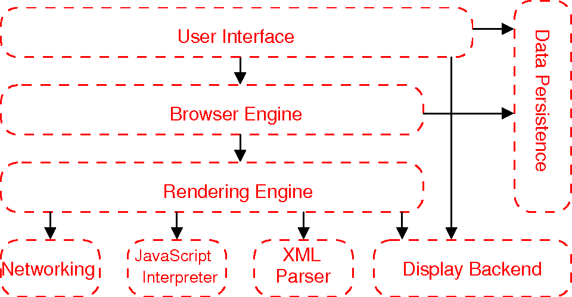
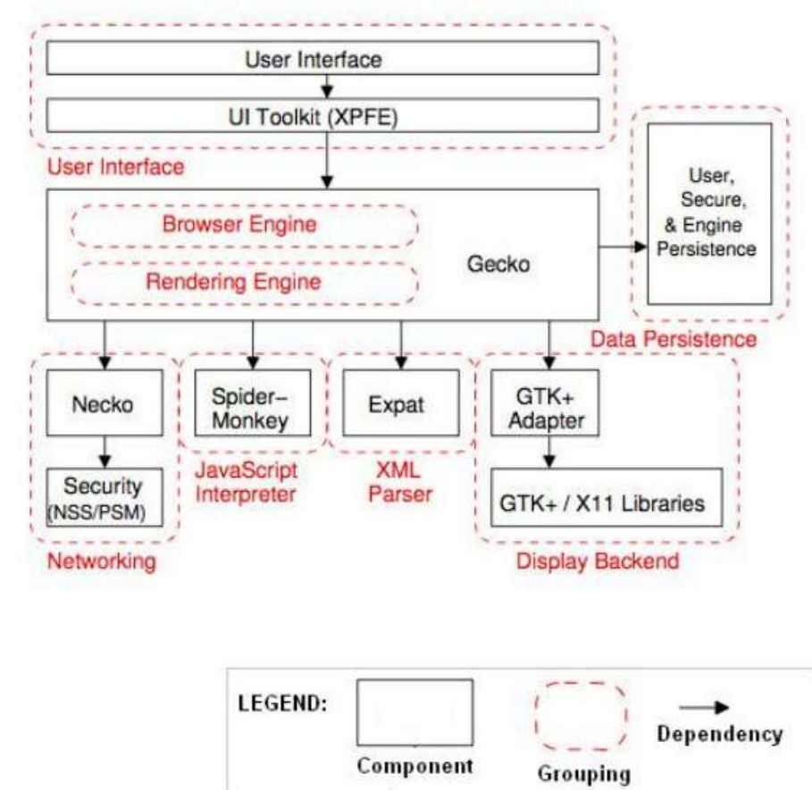
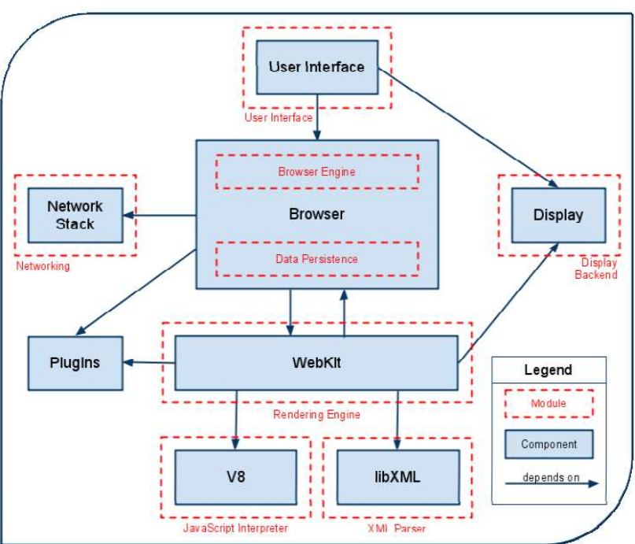
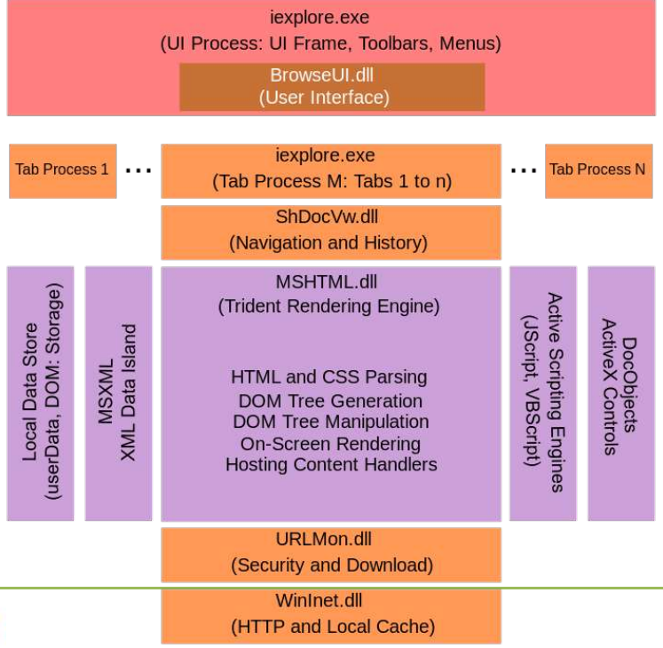
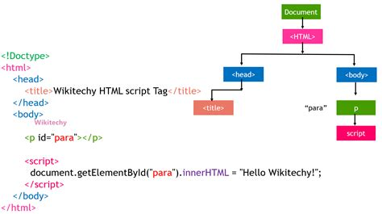
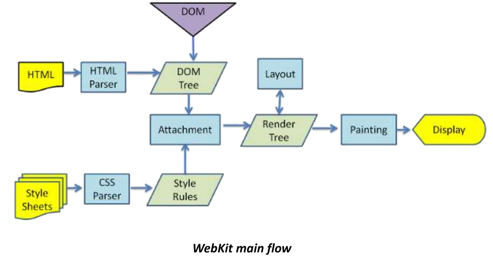
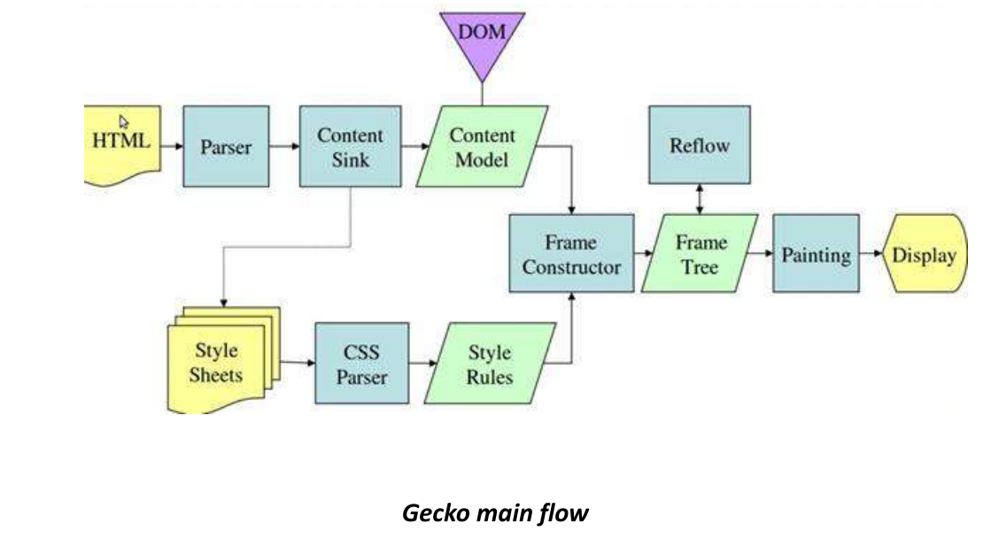

# 2 - Browser Internals

## Web Browser Architecture

The architecture browsers are different depending on whose browser it is
- Chrome, Edge, Safari and Firefox all have unique architectures
- There is no "browser standard"
- However, they do have to support web standards like HTML, CSS and JavaScript
- This means they tend to have similar architectures 

## Generic Subsystems

There are eight major subsystems in a browser




#### User Interface

1. User Interface (UI)

The User Interface encompasses everything users interact with directly and provides an intuitive way for users to navigate and control their browsing experience.

Key Elements: 
- Address Bar: Input field for URLs.
- Back/Forward Buttons: Navigation controls.
- Bookmarks Bar: Quick access to saved pages.
- Tabs: Multiple web pages in one window.
- Reload/Stop Buttons: Refresh or stop page loading. 
- Settings and Menus: Access to configurations and tools.


#### Browser Engine

Provides a high-level interface to the Rendering Engine
- Loads a given URI and supports primitive browsing actions such as forward, back, and reload
- Provides hooks for viewing various aspects of the browsing session such as current page load progress and JavaScript alerts
- Allows the querying and manipulation of Rendering Engine settings

Implementations:
- Gecko (used by Firefox)
- Blink (used by Chrome, Edge, and Opera)

### Rendering Engine

Responsible for displaying requested content on the screen.

Primary Functions:
- Parses HTML and builds the DOM tree.
- Parses CSS and creates the CSSOM tree.
- Combines the DOM and CSSOM into a render tree.
- Handles layout (positioning elements) and painting (drawing pixels on the screen).
- IBrowsers run multiple instances of the rendering engine: one for each tab. 
- Each tab runs in a separate process.
- The HTML parser is quite complex because it allows the Rendering Engine to display poorly formed HTML pages

Common Rendering Engines:
- Blink (Chrome, Edge)
- WebKit (Safari)
- Gecko (Firefox)

### JavaScript Engine

Executes JavaScript code embedded in web pages.

Primary Functions:
- Processes dynamic page content.
- Handles asynchronous operations (e.g., AJAX requests).
- Optimizes performance through just-in-time (JIT) compilation.

Popular JavaScript Engines:
- V8 (Chrome, Edge)
- SpiderMonkey (Firefox)
- JavaScriptCore (Safari)

### Networking Layer

Manages network communication, handling requests and responses.

Primary Functions:
- Sends HTTP/HTTPS requests to servers.
- Manages cookies, caching, and proxy configurations.
- Ensures secure connections via SSL/TLS.

### UI Backend

Handles rendering basic UI components independent of the rendering engine.

Primary Functions:
- Draws elements like combo boxes and windows.
- Integrates with the operating system’s native UI libraries.

### Data Storage

Local browser persistent storage, like:
- Cookies: Store small pieces of data like session information.
- Local Storage & Session Storage: Store larger data for client-side use.
- IndexedDB: A low-level API for storing structured data.
- Cache Storage: Speeds up loading of previously visited sites.

### Security Components

Ensures safe browsing and protection from malicious content.

Security Measures:
- Sandboxing: Isolates browser processes to prevent harmful code execution.
- Same-Origin Policy: Restricts interactions between different websites to prevent attacks.
- Content Security Policy (CSP): Blocks malicious scripts.
- HTTPS Enforcement: Ensures secure data transmission.

### Extensions and Plugin Manager

Allows users to extend browser functionality.
- Extensions: Add-ons for ad-blocking, password management, etc.
- Plugins: Historically used for media playback (largely deprecated). 

### DevTools

Built-in tools for developers to inspect and debug web applications.
- Inspect HTML/CSS and live-edit code.
- Monitor network activity.
- Debug JavaScript.
- Analyze performance and accessibility.

## Specific Browsers

[Comparison of browser engines](https://en.wikipedia.org/wiki/Comparison_of_browser_engines)

### FireFox



### Chrome



### Internet Explorer



## The DOM Tree

[Introduction to the DOM](https://developer.mozilla.org/en-US/docs/Web/API/Document_Object_Model/Introduction)

- The Document Object Model (DOM) is a programming interface that represents the structure of an HTML or XML document as a tree of nodes. 
- Each node corresponds to a part of the document, such as elements, attributes, or text. 
- It is a hierarchical representation of this structure that allows Javascript to access, modify, and manipulate the content and structure of a web page.
- The DOM is platform and language independent, but it is most commonly manipulated using JavaScript.

### Purpose of the DOM Tree

#### Bridge Between Code and Display:

- Converts the HTML document into a structure that browsers can render and manipulate.
- Enables JavaScript to interact with and modify web page content in real time (e.g., updating text, changing styles, adding or removing elements).
- Provides a way to capture and respond to user interactions (clicks, key presses, form submissions).
- Offers a structured method to navigate and access different parts of a web page.
- Serves as the foundation for rendering the visual representation of a page.



### How the DOM Tree Works 

#### 1. Building the DOM Tree

When a web page is loaded:
- The browser’s HTML parser reads the HTML file from top to bottom.
- For each HTML element, a corresponding node is created and added to the DOM tree.
- Parent-child relationships are formed based on how the HTML elements are nested.

```html 

<!DOCTYPE html>
<html>
  <head>
    <title>Example Page</title>
  </head>
  <body>
    <h1>Hello, World!</h1>
    <p>This is a paragraph.</p>
  </body>
</html>

```
Corresponding DOM Tree:

```text 
Document
└── html
├── head
│    └── title ("Example Page")
└── body
├── h1 ("Hello, World!")
└── p ("This is a paragraph.")

```


#### 2. Node Types in the DOM

1. Element Nodes: Represent HTML elements (e.g., `<div>`, `<p>`, `<h1>`).
2. Text Nodes: Contain text inside elements.
3. Attribute Nodes: Represent element attributes (e.g., class, id).
4. Comment Nodes: Represent HTML comments.

#### 3. Navigating the DOM Tree

JavaScript provides methods to traverse and manipulate the DOM:

#### 4. DOM Updates and Reflow

When changes are made to the DOM:
- Reflow: Recalculates element sizes and positions.
- Repaint: Updates the visual display if styles have changed.
- Minimizing unnecessary DOM manipulations improves performance.

#### 5. Event Handling Through the DOM

The DOM allows attaching event listeners:
```javascript
document.querySelector("h1").addEventListener("click", function() {
alert("Heading clicked!");
});
```
This lets developers create interactive web pages.

## Parsing

Process of converting a sequence of characters (HTML/CSS code) into a structured format that browsers can understand and use.

Why Parsing Matters is important
- Parsing errors can lead to incomplete or incorrectly rendered pages.
- Understanding parsing helps identify why certain elements fail to display or function.
- Improperly structured code may pass in one browser but fail in another.

### HTML Parsing Process:

Tokenization:
- The browser reads the HTML file character by character and breaks it into tokens (e.g., start tags, end tags, text nodes).

Tree Construction: 
- Tokens are converted into nodes, which are organized into a Document Object Model (DOM) tree.
- The DOM represents the document’s structure as a hierarchy of elements.

Error Handling: 
- Browsers are lenient and use error-correcting algorithms to handle malformed HTML.
- Malformed tags or missing end tags may still render but could break automation scripts or visual layouts.
- Use browser developer tools to inspect the actual DOM versus the original HTML source.


### Parsing CSS and Building the CSSOM Tree

Tokenization: 
- CSS files are parsed into tokens (selectors, properties, and values).

Building the CSS Object Model (CSSOM):
- Tokens are converted into nodes representing style rules.
- CSSOM maps styles to DOM elements.

```css
h1 { color: blue; }
p { font-size: 14px; }
```
Resulting CSSOM Tree:

```text
CSSOM
├── h1
│    └── color: blue
└── p
└── font-size: 14px

```

- Conflicts in CSS specificity may cause styles not to apply as expected.
- Test various screen sizes to identify responsive design issues stemming from media queries.

### Constructing the Render Tree

Combining DOM and CSSOM:
- Render Tree: Merges the DOM and CSSOM to determine what is actually visible.
- Non-visual elements, like `<head>`, `<script>`, `<meta>`) are excluded.

Example Render Tree

```text
Render Tree
└── body
├── h1 (color: blue)
└── p (font-size: 14px)
```

Common Issues Affecting the Render Tree:
- Missing CSS files or delayed loading.
- Incorrectly scoped selectors.
- JavaScript errors affecting dynamic content injection.






### JavaScript and Dynamic Tree Manipulation

JavaScript can modify the DOM and CSSOM after initial parsing:

Example:

The following code, when executed, updates the render tree with the new style, triggering a repaint.

```javascript
document.querySelector("h1").style.color = "red";
```

Dynamic content can lead to reflows and repaints, affecting performance.
    Test content generated by JavaScript separately from static content.

### Reflows:

"Reflow" is the term that for when the browser recalculates the positions, sizes, and geometry of elements on a web page. 
- Occurs when changes affect the layout or structure of the document, requiring the browser to re-calculate how elements should be displayed.

Reflow triggers:
- Changing the dimensions (width, height, margins, paddings) of an element.
- Adding, removing, or modifying DOM elements.
- Changing font sizes or styles.
- Resizing the browser window.
- Manipulating elements with JavaScript (e.g., element.style.height = "100px").
- Using properties like offsetHeight, clientWidth, or getComputedStyle (these force reflow to get up-to-date layout information).

Why Reflow Matters

Performance Impact:
- Reflow can be computationally expensive, especially for complex pages with many elements.
- Repeated or unnecessary reflows (often caused by inefficient JavaScript manipulations) can lead to sluggish performance.

Test Considerations:
- Identify areas where reflows occur frequently (e.g., during animations or scrolling).
- Test on lower-end devices where the performance hit is more noticeable.
- Use browser dev tools to monitor layout thrashing (excessive reflows caused by alternating DOM reads and writes).

To identify reflows, open a browser devtools extension and look for "Layout events"

### Repaint

Occurs when a web browsers updates the visual appearance of elements on a web page without affecting their layout or geometry. 
- When an element’s visual properties (like color, background, visibility, or shadow) change, the browser redraws the affected pixels on the screen.
- Unlike reflow, which recalculates the entire layout, repaint only involves updating the visual styles, making it less computationally expensive but still impactful for performance if triggered frequently.

## Webpack

[Webpack Tutorial: Understanding How it Works](https://blog.ag-grid.com/webpack-tutorial-understanding-how-it-works/)

[Webpack home page](https://webpack.js.org/)

[Webpack Book](https://survivejs.com/books/webpack/)


Webpack is an open-source module bundler for modern JavaScript applications. 
- Processes and bundles various assets (JavaScript, CSS, images, fonts) into optimized files that can be served efficiently to browsers.
- Web applications often are made up of multiple files (JavaScript modules, stylesheets, images).
- Browsers work best with a few optimized files rather than many separate ones.
- Webpack bundles, transforms, and optimizes these resources for better performance.

Used by various frameworks like Angular
- Convert HTML and CSS into JavaScript which is used to build the DOM tree directly
- Avoids having the browser parse HTML and CSS files.

## Shadow Dom

[Using shadow DOM](https://developer.mozilla.org/en-US/docs/Web/API/Web_components/Using_shadow_DOM)

The Shadow DOM is a web standard that allows developers to create encapsulated DOM trees within a web component.
- It provides a way to isolate styles and markup from the main document DOM, preventing conflicts and enabling the creation of reusable components without worrying about CSS or JavaScript interference.

Encapsulation:
- Styles and scripts inside the Shadow DOM do not leak out to the main DOM.
- Styles from the main document do not affect elements inside the Shadow DOM.

Reusable Web Components:
- Essential for building custom elements and modular UI components.

Avoids Global Style Conflicts:
- Prevents global CSS affecting isolated components.

Cleaner DOM Structure:
- Separates component internals from the main document structure.

Common Use Cases
- Building design systems with reusable UI components.
- Encapsulating styles in custom elements (e.g., <my-button>).
- Avoiding conflicts in large applications with multiple developers.


