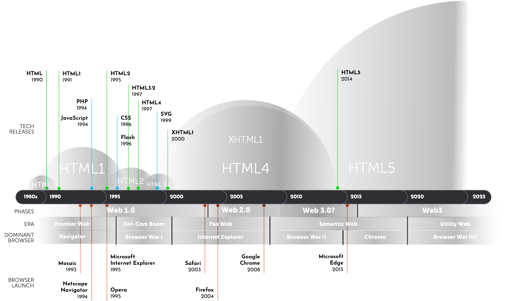
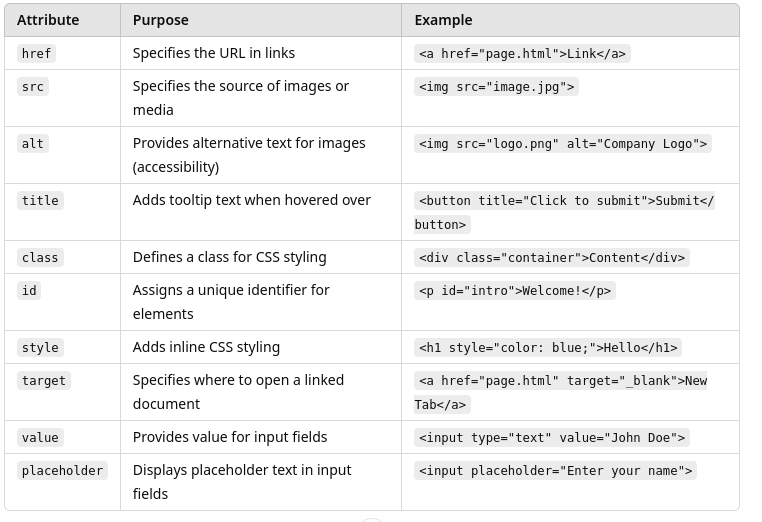
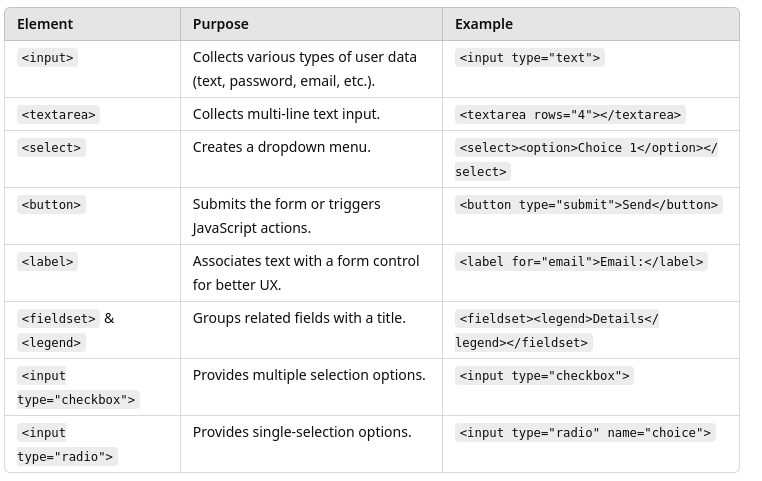
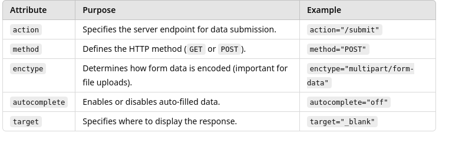
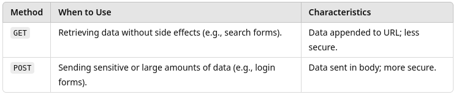
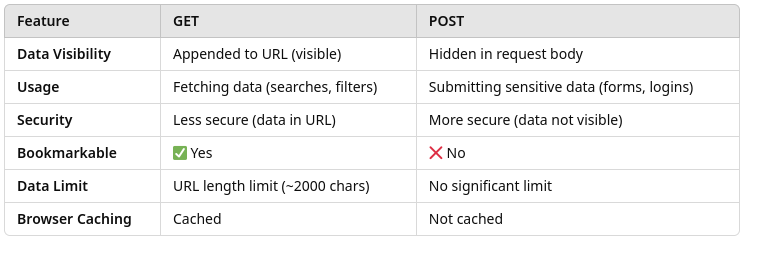
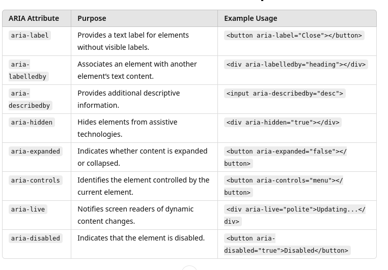

# 3 - HTML Basics

## SGML

Standard Generalized Markup Language (SGML) is an international standard (ISO 8879:1986) for defining generalized markup languages used to represent documents in electronic form. 

SGML is a meta-language that provides a framework for creating specific markup languages that describe a document's structure and attributes, rather than its processing or presentation. 


### Key Features of SGML:

Declarative Markup 

- SGML emphasizes describing the structure and attributes of documents without dictating how they should be processed or displayed. 
- This separation allows for flexibility in rendering content across different platforms and devices.

Rigorous Structure: 

- Documents defined using SGML adhere to strict syntactical rules, ensuring consistency and reliability in document representation.

Device and System Independence

- SGML's standardized approach enables documents to be shared and accessed across various systems without compatibility issues.

#### Historical Context:

- SGML was developed in the 1980s
- It has been used to define two specific markup application languages: HTML and XML
- HTML5 is no longer based on SGML but has become a separate standard. 
- XML, on the other hand, is a simplified subset of SGML designed structured data exchange

[A Gentle Introduction to SGML](https://www.tei-c.org/Vault/GL/P3/SG.htm)

#### SGML Example

An SGML application is defined by a schema definition that describes the markup tags to be used and their syntactic rules of use in something called a `DTD` or "Document Tad Definition" 

```html
  <!ELEMENT anthology      - -  (poem+)>
  <!ELEMENT poem           - -  (title?, stanza+)>
  <!ELEMENT title          - O  (#PCDATA) >
  <!ELEMENT stanza         - O  (line+)   >
  !ELEMENT line           O O  (#PCDATA) >
```

Documents that follow the rules of a DTD are said to be valid instances of the document.

````xml
    <anthology>
         <poem><title>The SICK ROSE
         <stanza>
              <line>O Rose thou art sick.
              <line>The invisible worm,
              <line>That flies in the night
              <line>In the howling storm:
         <stanza>
              <line>Has found out thy bed
              <line>Of crimson joy:
              <line>And his dark secret love
              <line>Does thy life destroy.

         <poem>
              <!-- more poems go here    -->

    </anthology>
````

## XML

Extensible Markup Language (XML) is a flexible, text-based format used to represent structured data. 
- SML is a lightweight subset of SGML 
- Allows users to define their own custom tags and semantic rules in a `schema` (older versions of XML used SGML DTDs)
- XML is often used in HTTP to encode data being sent to and from a server.


### Well-formed and valid XML

Because XML is primarily used for data transfer, its syntactic rules are much stricter than HTML
- For example, all XML tags must have a corresponding closing tag
- When an XML document conforms to the XML syntactic rules, it is said to be `well formed` or `syntactically valid`

Examples of XML rules

- XML documents must have a root element
- XML elements must have a closing tag
- XML tags are case sensitive
- XML elements must be properly nested
- XML attribute values must be quoted

The schema defines the rules for determining if the content an XML document is meaningful or `semantically valid`. 

For example, a part of a schema that defines what a `ship-to` element should like is shown below.

```xml
<xs:element name="shipto">
  <xs:complexType>
    <xs:sequence>
      <xs:element name="name" type="xs:string"/>
      <xs:element name="address" type="xs:string"/>
      <xs:element name="city" type="xs:string"/>
      <xs:element name="country" type="xs:string"/>
    </xs:sequence>
  </xs:complexType>
</xs:element> 
```
 
Which would be used to semantically as part of semantically validating a document like this. Note that the third line of the document identifies the schema `shiporder.xsd` that it should conform to.

```xml
<?xml version="1.0" encoding="UTF-8"?>

<shiporder orderid="889923"
xmlns:xsi="http://www.w3.org/2001/XMLSchema-instance"
xsi:noNamespaceSchemaLocation="shiporder.xsd">
  <orderperson>John Smith</orderperson>
  <shipto>
    <name>Ola Nordmann</name>
    <address>Langgt 23</address>
    <city>4000 Stavanger</city>
    <country>Norway</country>
  </shipto>
  <item>
    <title>Empire Burlesque</title>
    <note>Special Edition</note>
    <quantity>1</quantity>
    <price>10.90</price>
  </item>
  <item>
    <title>Hide your heart</title>
    <quantity>1</quantity>
    <price>9.90</price>
  </item>
</shiporder> 
```

In the absence of a schema reference, the document is assumed to be semantically valid. 
- Schemas are normally only used when we need to confirm the content of the document is correct


## HTML History



HyperText Markup Language (HTML) has undergone significant evolution since its inception, adapting to the changing needs of the web and its users. Here's a concise overview of its development.

Knowing this evolution is important from a testing perspective since regression testing or testing changes to a legacy web application may require adapting the testing to the version of HTML that was used to design the application

### Early Development (1990-1995):

- 1990: Tim Berners-Lee, a physicist at CERN, proposed and prototyped a system called ENQUIRE, laying the groundwork for the World Wide Web.
- 1991: Berners-Lee introduced the first version of HTML, comprising 18 tags, to facilitate the sharing and structuring of documents on the web.
- 1993: The Internet Engineering Task Force (IETF) published the "Hypertext Markup Language" Internet Draft, marking the first formal HTML specification.

### Standardization and Growth (1995-1999):

- 1995: HTML 2.0 was standardized, incorporating features from previous drafts and establishing a baseline for future development.
- 1997: The World Wide Web Consortium (W3C) released HTML 3.2, code-named "Wilbur," which integrated support for tables, applets, and text flow around images.
- 1999: HTML 4.01 became a W3C Recommendation, refining the language with improved support for stylesheets, scripting, and internationalization.

Released in 1997, HTML4 was a significant milestone in web development. 
- It was defined as an application of the Standard Generalized Markup Language (SGML)
- HTML4 introduced three Document Type Definitions (DTDs): Strict, Transitional, and Frameset, each catering to different needs regarding document structure and presentation.
- The specification provided a formal SGML definition of HTML4, including the SGML declaration, Document Type Definition (DTD), and character entity references.


### Introduction and Evolution of XHTML (2000-2010):

- 2000: XHTML 1.0 was published as a W3C Recommendation on January 26, 2000. This version reformulated HTML 4.01 in XML, enforcing stricter syntax rules to improve interoperability across different platforms and devices.
- 2001: XHTML 1.1 was released as a W3C Recommendation on May 31, 2001. It was based on XHTML 1.0 Strict but modularized, allowing for greater flexibility and extensibility in web document design.
- 2006: Efforts to develop XHTML 2.0 were underway, aiming to introduce new features and improvements. However, this version was never finalized, and work on it was officially discontinued in 2009 in favor of HTML5.

As the web grew, the need for a more rigorous and extensible markup language became apparent. 
- This led to the development of XHTML (Extensible HyperText Markup Language), which reformulated HTML4 as an application of XML (Extensible Markup Language). 
- XHTML enforced stricter syntax rules, requiring elements to be properly nested and closed, and attributes to be quoted, aligning with XML's standards. 
- This strictness aimed to improve interoperability with other XML-based systems and enhance document parsing. 
- The XHTML 1.0 specification outlines these guidelines and provides three DTDs: Strict, Transitional, and Frameset, mirroring those in HTML4.

### Transition to HTML5 (2008-Present):

- 2008: Development of HTML5 commenced, aiming to address the limitations of previous versions and adapt to the evolving web landscape.
- 2014: HTML5 was officially published as a W3C Recommendation, introducing new semantic elements, APIs, and enhanced multimedia support.

Recognizing the need to adapt to the evolving web landscape, HTML5 was developed to enhance support for multimedia, improve semantic structuring, and provide robust APIs for complex web applications. 
- Unlike its predecessors, HTML5 is not based on SGML and does not require a reference to a DTD. 
- It introduced new semantic elements like `<article>`, `<section>`, and `<nav>`, as well as APIs for offline storage, multimedia playback, and more. 
- HTML5 also relaxed some of the strict parsing rules of XHTML, allowing for more flexibility while maintaining a well-defined parsing algorithm to ensure consistent behavior across browsers.

## HTML Specification

[HTML 5 Specification](https://html.spec.whatwg.org/)

An HTML document is structured to define the content and relationship of the elements that make up a web page. Key components include:

**Document Type Declaration (`<!DOCTYPE html>`):** 
- This declaration defines the document type and version of HTML being used. 
- In HTML5, it's simply <!DOCTYPE html>. 
- For HTML4 using the strict DTD, it would be of the form: 
  - `<!DOCTYPE HTML PUBLIC "-//W3C//DTD HTML 4.01//EN""http://www.w3.org/TR/html4/strict.dtd">`
- For XHTML using the strict DTD, it would be:
  - `<!DOCTYPE html PUBLIC "-//W3C//DTD XHTML 1.0 Strict//EN""http://www.w3.org/TR/xhtml1/DTD/xhtml1-strict.dtd">`
- This declaration ensures that the browser renders the page in standards mode, promoting consistent behavior across different browsers.

**Root Element (`<html>`):** Encapsulates all the content of the HTML document. It typically includes attributes like lang to specify the language of the document, aiding in accessibility and search engine optimization.

H**ead Section (`<head>`)**: Contains meta-information about the document, such as:
- Metadata (`<meta>` tags): Provide information like character set (`<meta charset="UTF-8">`), author, and viewport settings for responsive design.
- Title (`<title>`): Sets the title of the document, which appears in the browser's title bar or tab.
- Links to Resources: Includes references to external stylesheets (`<link>`), scripts (`<script>`), and icons.

**Body Section (`<body>`)**: Houses all the content intended for display to the user, including:
- Headings (`<h1>` to `<h6>`): Define the hierarchical structure of the content.
- Paragraphs (`<p>`): Represent blocks of text.
- Links (`<a>`): Create hyperlinks to other documents or resources.
- Images (`)`: Embed images into the page.
- Lists (`<ul>`, `<ol>`, `<li>`): Define unordered and ordered lists.
- Divisions and Spans (`<div>`, `<span>`): Generic containers for grouping and styling content.

## Semantic Tags

Semantic HTML elements are those that clearly describe their meaning in a human-readable way. 
- These elements not only structure the content but also convey the role and importance of the content enclosed within them.

Key Semantic HTML Elements:
- `<header>`: Represents introductory content, typically a group of introductory or navigational aids.
- `<nav>`: Defines a set of navigation links.
- `<main>`: Specifies the main content of a document, unique and central to the document's purpose.
- `<section>`: Encapsulates a thematic grouping of content, typically with a heading.
- `<article>`: Denotes a self-contained composition that could be independently distributed or reused, such as a blog post or news article.
- `<aside>`: Contains content indirectly related to the main content, often presented as a sidebar.
- `<footer>`: Represents the footer for its nearest sectioning content or sectioning root element.
- `<figure>`: Specifies self-contained content, like illustrations, diagrams, or photos, often with a caption.
- `<figcaption>`: Provides a caption for the `<figure>` element.
- `<mark>`: Highlights text that is of special relevance or interest.
- `<time>`: Represents a specific period in time.

```html
<!DOCTYPE html>
<html lang="en">
<head>
    <meta charset="UTF-8">
    <title>Semantic HTML5 Example</title>
</head>
<body>
    <header>
        <h1>Welcome to My Website</h1>
        <nav>
            <ul>
                <li><a href="#home">Home</a></li>
                <li><a href="#about">About</a></li>
                <li><a href="#contact">Contact</a></li>
            </ul>
        </nav>
    </header>
    <main>
        <article>
            <header>
                <h2>Understanding Semantic HTML5</h2>
                <p>Published on <time datetime="2025-02-23">February 23, 2025</time> by Jane Doe</p>
            </header>
            <section>
                <h3>What is Semantic HTML?</h3>
                <p>Semantic HTML introduces meaning to the web page rather than just presentation. Elements such as <code>&lt;header&gt;</code>, <code>&lt;nav&gt;</code>, <code>&lt;main&gt;</code>, and <code>&lt;footer&gt;</code> clearly define the structure and content of a web page.</p>
            </section>
            <section>
                <h3>Benefits of Using Semantic Tags</h3>
                <p>Utilizing semantic tags improves accessibility, SEO, and code maintainability. It allows browsers and assistive technologies to better understand the content, leading to enhanced user experiences.</p>
            </section>
        </article>
    </main>
    <aside>
        <h2>Related Articles</h2>
        <ul>
            <li><a href="#semantics">The Importance of Semantics in Web Development</a></li>
            <li><a href="#html5">New Features in HTML5</a></li>
        </ul>
    </aside>
    <footer>
        <p>&copy; 2025 My Website. All rights reserved.</p>
    </footer>
</body>
</html>

```

## Attributes

Attributes are name value pairs of information added to HTML elements to provide additional details, configure behavior, or control the appearance of those elements. 
- They are always included in the opening tag of an element a

- Basic syntax:
- 
```html
<element attribute="value">Content</element>
```
- `<a>` is the anchor (link) element.
- `href` is the name of the attribute that specifies the URL to navigate to.
- "https://www.example.com" is the value of the attribute.

### Purpose of Attributes

One way to thing of the relationship between tags and attributes is to thing of a tag as a function in a programming language and attributes as parameters to the function

Provide Additional Information:
- Define how an element should behave (e.g., href in `<a>`, src in ``).
- Example: `` provides the image source and an alternate text.

Control Element Behavior:
- Influence functionality like form submissions (action, method) or link targets (target="_blank").

Improve Accessibility:
- Attributes like alt, aria-*, and role enhance the usability of web pages for people using assistive technologies.

Enable Styling and Scripting:
- Attributes like class, id, and style help apply CSS and JavaScript.

Enhance SEO and Metadata:
- Meta tags with attributes (e.g., `<meta name="description" content="Page description">`) help search engines understand page content.

##### Commonly used Attributes



## Forms

HTML forms users to submit data to a web server. 
- Forms are essential for various interactions, such as logging in, signing up, searching, and providing feedback.

### Basic Structure of an HTML Form

```html
<form action="/submit" method="POST">
  <label for="name">Name:</label>
  <input type="text" id="name" name="username" placeholder="Enter your name" required>

<label for="email">Email:</label>
<input type="email" id="email" name="email" required>

  <input type="submit" value="Submit">
</form>
 ```

Explanation

- `<form>`: The container that holds all form elements.
- action: URL where the form data will be sent.
- method: HTTP method (GET or POST) used to submit the form.
- `<label>`: Provides descriptive text for form fields (improves accessibility).
- `<input>`: Collects user data (various types like text, email, password).
- `<input type="submit">`: Button to submit the form data.

##### Common Form Elements



##### Common Form Attributes



##### HTTP Submission

The data from a form is sent to the server using either an HTTP GET request or a POST request. The difference between the two is where the query data is located in the message



Characteristics of GET:
- Data is sent as part of the URL (after the ? symbol).
- Parameters are visible and bookmarked.
- Limited to URL length restrictions (~2000 characters).
- Ideal for non-sensitive data (e.g., searches, filters).

```html
<form action="/search" method="GET">
  <label for="query">Search:</label>
  <input type="text" id="query" name="query" placeholder="Enter a search term">
  <input type="submit" value="Search">
</form>
```
The above request will send the following GET request

```html
https:website.com/search?query=apple

```

Characteristics of a POST:
- Data is sent in the request body (using XML or JSon), making it invisible in the URL.
- No character length limitations for the data.
- Safer for transmitting sensitive information (e.g., passwords).
- Cannot be bookmarked with parameters.

```html
<form action="/submit" method="POST">
  <label for="username">Username:</label>
  <input type="text" id="username" name="username">
  
  <label for="password">Password:</label>
  <input type="password" id="password" name="password">
  
  <input type="submit" value="Submit">
</form>
```
Now the request URL looks like this

```html
https:website.com/search
```

But the body of the request looks like this:

```xml
<?xml version="1.0" encoding="UTF-8"?>
<loginRequest>
  <username>johndoe</username>
  <password>secure123</password>
</loginRequest>
```

Submitting data via POST. Note the content header tells the server the data is in XML format.

```shell
curl -X POST https://example.com/submit \
     -H "Content-Type: application/xml" \
     -d '<?xml version="1.0" encoding="UTF-8"?><loginRequest><username>johndoe</username><password>secure123</password></loginRequest>'
```

Or as JSON

```shell
curl -X POST https://example.com/submit \
     -H "Content-Type: application/json" \
     -d '{"loginRequest": {"username": "johndoe", "password": "secure123"}}'

```

##### GET vs POST Summary



### Form Validation and Accessibility

Client-Side Validation:
- Use attributes like required, minlength, and pattern to validate input before submission.

Accessibility Considerations:
- Always use `<label>` tags associated with form controls.
- Include descriptive placeholder and aria-* attributes for screen readers.

Example of Validated Input:

```html
<input type="password" name="pwd" required minlength="8" placeholder="Enter password">
```

### ARIA Attributes in HTML

ARIA stands for Accessible Rich Internet Applications. 
- A set of special attributes (prefixed with aria-) that enhance the accessibility of web content
- Particularly for users relying on assistive technologies like screen readers.
- Improves access to dynamic content and custom components that aren’t natively accessible.
- Communicates the role, state, and properties of elements to assistive devices.
- Ensures a more inclusive web experience for users with disabilities.

Structure of ARIA Attributes

ARIA attributes typically fall into three categories:
1. Roles (role): Defines the purpose of an element (e.g., role="button", role="dialog").
2. States (aria-*): Describes the current condition of an element (e.g., aria-expanded="true").
3. Properties (aria-*): Provides additional information about elements (e.g., aria-labelledby, aria-hidden).



### Why Forms Matter for Testers

Functional Testing:
- Verify that data is correctly submitted and processed.
- Ensure proper redirection or error messages are shown.

Security Testing:
- Check for vulnerabilities like Cross-Site Scripting (XSS) and SQL Injection.
- Validate that sensitive data isn’t exposed through GET requests.

Usability & Accessibility:
- Test auto-fill, placeholder usability, and keyboard navigation.
- Ensure screen readers interpret form elements correctly.

## Validating HTML Structure and Automated Tools

Ensuring HTML code adheres to standards is essential for cross-browser compatibility and accessibility

Validation tools help identify and rectify errors. Notable tools include:
- W3C Markup Validation Service: A free service that checks HTML and XHTML documents for conformance to W3C standards.
- Nu Html Checker (v.Nu): An open-source, user-friendly tool for validating HTML5 documents.

Regular validation assists testers in maintaining high-quality, standards-compliant code.

## Best Practices of HTML Design

Suggested best practices
1. Consistent Indentation and Formatting: Improves code readability and collaboration.
2. Use of Semantic Tags: Promotes accessibility and SEO.
3. Externalize CSS and JavaScript: Separating styles and scripts from HTML reduces page load times and enhances caching.
4. Alt Attributes for Images: Provides descriptive text for screen readers, improving accessibility.
5. Avoid Inline Styles: Encourages the use of external stylesheets for cleaner code and easier maintenance.
6. Properties and Features of Testable HTML Documents

For effective testing, HTML documents should exhibit:
1. Unique Identifiers: Utilizing id attributes to facilitate precise element selection during testing.
2. Descriptive Class Names: Employing meaningful class names aids in understanding element purposes.
3. Accessible Attributes: Incorporating aria-* attributes enhances accessibility and allows for comprehensive accessibility testing.
4. Consistent Structure: Maintaining a predictable and logical document structure simplifies navigation and testing.
5. Comprehensive Form Labels: Ensuring all form elements have associated labels improves usability and testability.

### HTML Tables

[HTML table basics](https://developer.mozilla.org/en-US/docs/Learn_web_development/Core/Structuring_content/HTML_table_basics)

[W3C](https://www.w3schools.com/html/html_tables.asp)


