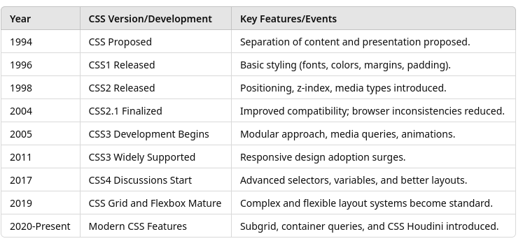

# 4 CSS Basics

Cascading Style Sheets (CSS) is a very deep subject, but for this course will stress the concepts, emphasizing the relationship they have with testing, specifically
- The purpose and role of CSS in web development.
- How CSS affects the presentation and layout of web pages.
- How CSS can impact accessibility, usability, and performance.
- Issues in testing CSS-related functionality, responsiveness, and rendering across browsers 

[CSS Reference](http://www.w3schools.com/cssref/index.php)

---

## History of CSS



#### 1994 – Proposal of CSS"

- Håkon Wium Lie proposed CSS while working at CERN with Tim Berners-Lee.
- The goal was to separate content structure from styling, as HTML was being misused for styling (e.g., <font> tags).

#### 1996 – CSS Level 1 (CSS1)

- Published by the W3C (World Wide Web Consortium).
- Introduced basic styling: fonts, colors, text alignment, margins, and padding.
- Focused on styling simple web documents.
- Testing Implications: Minimal cross-browser differences since browsers barely supported CSS fully.

#### 1998 – CSS Level 2 (CSS2)

- Introduced advanced features:
  - Positioning (absolute, relative, fixed).
  - Media types (e.g., print styles).
  - Improved selectors and z-index.
- Brought table layouts, font properties, and first steps toward responsive design.
- Challenges: Inconsistent browser support (notably Internet Explorer’s partial support).

#### 2004 – CSS2.1 (Refinement of CSS2)
- Removed poorly supported features from CSS2.
- Became the stable baseline for many years.
- Improved compatibility and reliability across browsers.
- Testing Focus: Ensuring consistent rendering across IE, Firefox, Safari, and early Chrome versions.

#### 2005 – Work Begins on CSS3
- Modularization: CSS3 was divided into modules for easier development and implementation (e.g., Selectors, Box Model, Backgrounds).
- Introduced features like:
  - Rounded corners (border-radius).
  - Box shadows and gradients.
  - Transitions and animations.
  - Media queries for responsive design.
- Testing Implications:
  - Responsive design testing became crucial.
  - Cross-browser testing intensified due to gradual module adoption.

#### 2011 – CSS3 Widespread Adoption
- Major browsers implemented most CSS3 features.
- Media queries revolutionized responsive web design.
- Web animations and transformations became native (without JavaScript reliance).
- Testing Considerations:
  - Validating responsiveness across devices became standard practice.
  - Performance testing to ensure animations didn’t degrade UX.

#### 2017 – Emergence of CSS4 Discussions
- No official “CSS4” standard, but new features evolved under CSS3 modules.
- Key advancements:
  - Enhanced selectors (:is(), :where()).
  - Custom properties (CSS variables).
  - Improved grid and flex layouts.
- Testing considerations
  - More dynamic layouts required robust responsive testing.
  - Browser support discrepancies persisted with cutting-edge features.

#### 2019 – CSS Grid & Flexbox Dominance
- CSS Grid Layout became widely supported, enabling complex layouts without floats.
- Flexbox simplified single-dimensional layouts.
- Developers started replacing older layout techniques (e.g., float-based designs).
- Testing Focus:
  - Ensuring layout integrity on varying screen sizes and browsers.
  - Testing for fallback support on older browsers without grid capabilities.

#### 2020 – Present: Modern CSS Evolution
- Subgrid support extended Grid functionality.
- Container Queries emerged for component-level responsiveness.
- Introduction of CSS Houdini for extending CSS capabilities.
- Focus on performance, accessibility, and native theming with variables.
- Implications for Testing:
  - Enhanced focus on accessibility testing through CSS features.
  - Responsive and dark mode testing became essential.
  - Ensuring backward compatibility for legacy system


---

## CSS Basics

CSS (Cascading Style Sheets) is a language used to control the presentation and layout of HTML documents. 
- It allows developers and designers to define how elements should appear on a webpage, including colors, fonts, spacing, and positioning.
- Separates content (HTML) from presentation (CSS), improving code maintainability.
- Enables consistent styling across multiple pages with a single stylesheet.
- Enhances user experience through responsive design and accessibility improvements.
  How CSS Styles Are Specified

### Applying Styles

CSS styles can be applied in three main ways:

#### Inline CSS (Directly on Elements)

Inline styles are specified within the style attribute of an HTML element.
- Use Case: Quick fixes or unique styles for a single element.
- Downside: Hard to maintain; overrides external and internal styles.
- Should not be used in production

```html
<p style="color: blue; font-size: 16px;">This text is blue and 16px in size.</p>
```

#### Internal CSS (Within the `<style>` Tag)

Internal styles are placed inside a `<style>` tag within the `<head>` section of the HTML document.
- Use Case: Styling single-page websites or when external CSS is not feasible.
- Downside: Not reusable across multiple pages.
- Should only be used as a last resort in production

```html
<!DOCTYPE html>
<html lang="en">
<head>
  <style>
    h1 { color: green; font-size: 24px; }
    p { font-family: Arial, sans-serif; }
  </style>
</head>
<body>
  <h1>Hello World</h1>
  <p>This paragraph is styled with internal CSS.</p>
</body>
</html>
```

#### External CSS (Linked Stylesheet)

External styles are defined in a separate .css file and linked to the HTML document using the `<link>` tag.
- Use Case: Best for large projects and multiple web pages for consistent styling.
- Benefit: Improves website load time through caching and simplifies maintenance.

```html 
<!-- HTML File -->
<link rel="stylesheet" href="styles.css">

/* styles.css */
h1 { color: red; }
p { font-size: 14px; line-height: 1.5; }

```

## CSS Syntax Explained

```css
selector {
property: value;
}
```

Components:
- Selector: Targets the HTML element (e.g., p, .class, #id).
- Property: Specifies the aspect of the element to style (e.g., color, font-size).
- Value: Defines the setting for the property (e.g., red, 16px).

Example:

```css
p {
color: blue;        /* Text color is blue */
font-size: 16px;    /* Font size is 16 pixels */
margin: 10px;       /* Adds space around the paragraph */
}
```

## How CSS Works: The Cascade, Specificity, and Inheritance

CSS stands for Cascading Style Sheets, meaning styles are applied based on rules from cascading order, specificity, and inheritance.

#### 1. The Cascade

When multiple styles conflict, the cascade determines which one takes precedence.

Order of Importance (Highest to Lowest):
1. Inline styles (style attribute)
2. Internal styles (within `<style>` tags)
3. External stylesheets (linked via `<link>`)
4. Browser default styles

#### 2. Specificity

When multiple rules apply to the same element, specificity decides which one wins.

Specificity Hierarchy:
- Inline styles: style="color: red;"  > Highest specificity
- ID selectors: #header {} > High specificity
- Class selectors: .menu {} > Medium specificity
- Element selectors: p {} > Low specificity

Example:

```css
p { color: black; }         /* Low specificity */
#intro { color: blue; }     /* High specificity */
```
The paragraph with id="intro" will be blue due to higher specificity.

#### Inheritance

Some properties (like color and font-size) inherit from parent elements, while others (like margin, padding) do not.

```html
<div style="color: green;">
  <p>This paragraph inherits the green color.</p>
</div>
```

Always verify if unexpected styles are due to inherited properties.

#### How Styles Are Rendered by the Browser

1. HTML Parsing: Browser reads HTML and builds the DOM (Document Object Model).
2. CSS Parsing: CSS is parsed into the CSSOM (CSS Object Model).
3. Render Tree Construction: DOM and CSSOM are combined.
4. Layout & Painting: Browser calculates positions, sizes, and paints the final output.

Why is this important?
- CSS errors can cause rendering issues like text overlaps and hidden elements.
- Performance issues can arise from inefficient CSS rules.

#### CSS Testing Considerations for Testers

Visual Consistency:
- Check if styles render consistently across browsers and devices.

Responsive Design:
- Test layouts with different screen sizes and orientations.

Accessibility:
- Verify color contrasts, font sizes, and focus indicators.

Cross-Browser Testing:
- Test common browsers like Chrome, Firefox, Safari, and Edge.

Dynamic Content:
- Ensure dynamic changes (like hover effects or dropdowns) work correctly.

## CSS Classes

CSS classes allow developers to apply specific styles to one or more HTML elements. Classes help in organizing, reusing, and maintaining consistent styling across a web project.

Why Use Classes?
- Reusability: Apply the same styles to multiple elements.
- Flexibility: Style different elements with the same class.
- Maintainability: Easier to update styling in large projects.

### How CSS Classes Work

#### Defining and Applying a Class

Defining a class in CSS:

```css
.highlight {
background-color: yellow;
font-weight: bold;
}
```


Applying a class in HTML:

```html
<p class="highlight">This text is highlighted.</p>
<div class="highlight">This div also has the highlight style.</div>

```

- Both the <p> and <div> elements will have a yellow background and bold text.
- Class names are case-sensitive (.Highlight ≠ .highlight).

#### Syntax and Rules

CSS Syntax for Classes:

```css
.classname {
property: value;
}
```

HTML Usage:

```html
<div class="classname">Content</div>

```

Multiple Classes:

```html
<p class="highlight large-text">Styled with both classes.</p>
```

```css
.large-text {
font-size: 20px;
}

```
- The element inherits styles from both .highlight and .large-text.

## Advanced Usage of Classes

#### Chaining Classes:

```css
.button.primary {
background-color: blue;
color: white;
}
```
```html
<button class="button primary">Submit</button>
```
#### Descendant and Child Selectors:

Only .title elements inside .card will be styled.

```css
.card .title {
font-size: 18px;
}
```
```html
<div class="card">
  <h2 class="title">Card Title</h2>
</div>
```

### Testing Considerations for CSS Classes

Visual Consistency
- Verify that elements with the same class look consistent across pages.
- Test different states (hover, active, focus) if classes define them.

Responsive and Cross-Browser Testing
- Ensure classes responsible for layouts (e.g., .container, .row) work on all devices.
- Validate that classes render properly across Chrome, Firefox, Safari, Edge, and mobile browsers.

Overlapping Classes and Conflicts
- Watch out for class conflicts (e.g., .button vs .button.primary).
- Use browser DevTools to check applied styles and specificity issues.

Accessibility Testing
- Confirm classes don’t hide essential content with display: none or visibility: hidden.
- Ensure focus classes provide visible indicators for keyboard navigation.

Dynamic Class Manipulation
- Test JavaScript interactions that add/remove classes dynamically:

```javascript
document.querySelector('.menu').classList.toggle('open');
```
- Make sure UI changes reflect correctly when classes are added/removed.

Performance Considerations
- void overusing deeply nested classes, which can slow down rendering.
- Test for unused CSS classes that might bloat the codebase.


## CSS Pseudo-Classes

A CSS pseudo-class is a keyword added to a selector that targets elements based on their state or certain conditions in the document tree, without requiring changes to the HTML structure.

Usage
- Style elements based on user interaction (e.g., hover states).
- Target elements in specific positions (e.g., first or last child).
- Apply styles based on input validation or focus.

```css
selector:pseudo-class {
property: value;
}
```

When the user hovers over a link, its text color changes to red.

```css
a:hover {
color: red;
}
```
### How CSS Pseudo-Classes Work
 
- Pseudo-classes target element states rather than static attributes.
- They are added after the selector with a colon :.
- No need to add extra classes or IDs in the HTML.

Commonly used interaction pseudo classes


Structural Pseudo-Classes
- These target elements based on their position within the parent.


Form and Input Pseudo-Classes
- These target form elements based on their state.


Targeting Specific Elements


```css
p:first-of-type {
  font-weight: bold;
}

```

UI Element States (Dynamic Pseudo-Classes)


### Testing Considerations for Pseudo-Classes

- Pseudo-classes can affect accessibility and usability.
- They might not be visible in the HTML source, making it essential to use DevTools for inspection.
- Some pseudo-classes (like :hover) behave differently on mobile vs. desktop.

Checklist:
- Ensure interactive states (e.g., hover, focus) provide clear visual feedback.
- Test forms with :valid and :invalid pseudo-classes for accurate validation feedback.
- Validate cross-browser and cross-device compatibility for pseudo-class behaviors.
- Confirm that :focus indicators meet accessibility standards (especially for keyboard users).
- Check dynamic elements for proper application of pseudo-classes (e.g., when using JavaScript to modify classes).


## CSS Preprocessors

Several CSS preprocessors and postprocessors have been developed to make CSS easier to use on lange projects.

These tools add features like variables, nesting, and functions, making stylesheets more maintainable, scalable, and readable.

Why use alternatives to plain CSS?
- Handle large-scale projects with complex styles.
- Improve code organization and reusability.
- Enable advanced functionalities not natively supported in plain CSS.
- All of these preprocessors compile to plain css before they are applied.


### SCSS
SCSS is a superset of CSS introduced by the Sass (Syntactically Awesome Stylesheets) preprocessor. It uses CSS-like syntax while adding powerful features.

Key Features:
- Variables for reusable values. 
- Nesting for clearer hierarchy.
- Mixins for reusable code blocks.
- Partials and imports for code organization.
- Functions and operators for dynamic calculations.

```scss
$primary-color: #3498db;
nav {
  background-color: $primary-color;
  ul {
    list-style: none;
    li {
      display: inline-block;
      a {
        color: white;
        text-decoration: none;
      }
    }
  }
}
```
This compiles to the following CSS.

```css
nav {
background-color: #3498db;
}
nav ul {
list-style: none;
}
nav ul li {
display: inline-block;
}
nav ul li a {
color: white;
text-decoration: none;
}

```

Why Testers Should Care:
- SCSS compiles into CSS. Testers must verify if the compiled CSS is correct.
- Nested rules can cause unexpected specificity issues.
- Testers should ensure that variables and mixins don’t override essential styles unintentionally.

### Sass (Indented Syntax)

Sass is the original version of SCSS with indented syntax (no curly braces or semicolons).

```sass
$font-stack: Helvetica, sans-serif
body
font: 100% $font-stack
color: #333
```

Which compiles to 

```css
body {
  font: 100% Helvetica, sans-serif;
  color: #333;
}
```

Difference from SCSS:
- No curly braces {} or semicolons ;
- Functionally identical to SCSS but less commonly used today.

Testing Considerations:
- Focus remains on compiled CSS output.
- Verify that indentation is correct to avoid compilation errors.

### LESS (Leaner Style Sheets)

LESS is a preprocessor similar to SCSS but originally developed for JavaScript environments.

Key Features:
- Variables, mixins, and functions (like SCSS).
- Built-in support in tools like Bootstrap 3.

```less
@primary-color: #4CAF50;

button {
background-color: @primary-color;
&:hover {
background-color: darken(@primary-color, 10%);
}
}
```

Testing Implications:
- Similar to SCSS, ensure that compiled CSS matches design requirements.
- Watch for variable conflicts and unintended mixin applications.

### PostCSS (Postprocessor)

Unlike preprocessors, PostCSS processes CSS after it’s written. It uses plugins to add functionalities.

Popular Features (via Plugins):
- Autoprefixing for cross-browser compatibility.
- Minification to reduce file size.
- Linting for style enforcement.

Testing Relevance:
- Verify that vendor prefixes are added for older browser support.
- Test minified CSS for performance improvements without functionality loss.

## Pseudo Elements

CSS pseudo-elements are special keywords added to selectors that allow you to style specific parts of an element’s content without needing to add extra HTML markup. 
- They are extremely useful for applying styles to elements' sub-parts, adding content, or targeting text portions.

```css

selector::pseudo-element {
property: value;
}

```

- Double colons (::) are used for pseudo-elements to differentiate them from pseudo-classes.
- Some browsers still support single colon (:) for backward compatibility (e.g., :before instead of ::before).

Why Use Pseudo-Elements?
- Apply styles without cluttering the HTML structure.
- Enhance user interfaces with minimal code.
- Improve maintainability and consistency.
- Add decorative elements or extra content dynamically.

### Common CSS Pseudo-Elements

#### ::before Example

Inserts content before an element’s actual content.

Use Cases:
- Add icons, bullets, or labels.
- Create decorative elements.

```css 

h2::before {
content: "★ ";
color: gold;
}
```
```html
<h2>Featured Article</h2>
```
Produces 
```text
⭐ Featured Article
```
The star is added before the heading without changing the HTML.


### Testing Tips:

Always test pseudo-elements across multiple browsers to ensure consistent rendering.

Hidden Styles: 
- Elements styled with ::before or ::after may not be visible in the HTML source, requiring DevTools for inspection.

Accessibility Concerns:
- Ensure added content doesn’t hinder screen readers.
- Use meaningful content values for better UX.

Other points:
- Check if decorative elements load correctly.
- Verify that interactive pseudo-elements behave as intended (e.g., tooltips or icons).
- Test how styles respond in different themes (dark/light modes).

## The Box Model

The CSS box model is a fundamental concept in web design and development, defining how elements are structured and displayed on a webpage.  It consists of several components that determine the space an element occupies and how it relates to other elements.

Components of the CSS Box Model:
- Content: The innermost part where text and images appear.
- Padding: The space between the content and the border, creating inner spacing within the element.
- Border: A line surrounding the padding (if any) and content, effectively acting as the edge of the element.
- Margin: The outermost space that separates the element from other elements, providing external spacing.

[Introduction to the CSS basic box model](https://developer.mozilla.org/en-US/docs/Web/CSS/CSS_box_model/Introduction_to_the_CSS_box_model)

[W3c CSS Box Model](https://www.w3schools.com/css/css_boxmodel.asp)

[CSS Box Model](https://www.geeksforgeeks.org/css-box-model/)


## Flexbox and Grid

[FlexBox](https://developer.mozilla.org/en-US/docs/Web/CSS/CSS_flexible_box_layout/Basic_concepts_of_flexbox?utm_source=chatgpt.com)

[CSS Flexbox Layout Guide](https://css-tricks.com/snippets/css/a-guide-to-flexbox/)

[CSS Grid Layout Guide](https://css-tricks.com/snippets/css/complete-guide-grid/?utm_source=chatgpt.com)

[CSS grid layout](https://developer.mozilla.org/en-US/docs/Learn_web_development/Core/CSS_layout/Grids?utm_source=chatgpt.com)

