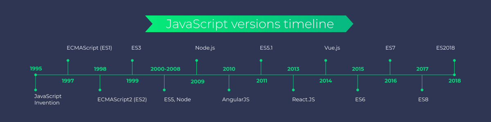

# 5 - JavaScript

## Introduction

JavaScript (JS) is a high-level, versatile programming language primarily used to create interactive and dynamic web pages.

Uses
- Client-Side: Runs in the browser to handle user interactions, animations, and dynamic content.
- Server-Side: With environments like Node.js, JavaScript can handle server-side operations.
- Versatile: Used for web apps, mobile apps, desktop apps, and even IoT devices.

Basic understanding of JavaScript in testing allows a tester to
- Identify and troubleshoot client-side issues.
- Test web applications where interactivity is controlled by JavaScript.
- Write automated tests using tools like Cypress, Selenium, or Playwright.
- Understand asynchronous operations (e.g., API calls) for better testing strategies.

We cannot do a full JavaScript course in class, but we touch on the major points relevant for testing.

🖥### Client-Side Uses

- Manipulating the DOM: Dynamically change content without reloading the page.
- Handling Events: Respond to user actions like clicks, form submissions, and key presses.
- Form Validation: Ensure data correctness before sending it to the server.
- Animations and Effects: Enhance user experience with interactive elements.
- Example: A button that reveals hidden content when clicked is usually controlled by JavaScript.

### Server-Side Uses (Node.js)

- Build scalable server applications.
- Handle databases and API requests.
- Run automated tests outside of browsers.
- Example: Websites like LinkedIn and Netflix use JavaScript on both client and server sides.
  - Note that even when JavaScript is used on the server, other programming languages like Go and Java are also used
  - Netflix uses Node.js for its server-side APIs but relies on Java for backend services handling large-scale data processing.

## Evolution of JavaScript

The evolution of JavaScript has been driven by development in other areas of web tech



[JavaScript Timeline](https://thelinuxcode.com/the-timeline-of-javascripts-evolution/)

[ECMA-262](https://ecma-international.org/publications-and-standards/standards/ecma-262/)

## Overview of JavaScript

Interpreted Language
- JavaScript is primarily interpreted by browsers meaning it doesn’t require a separate compilation step.
- Modern JavaScript engines use Just-In-Time (JIT) compilation for better performance.
- However, this means that errors may not be detected until the code fails to run
- Advantages
  - Faster development cycle.
  - Code changes are instantly testable without compilation delays.

Lightweight and Dynamic
- Designed to be a lightweight scripting language with minimal overhead.
- Dynamic typing allows variables to hold any data type without explicit declarations.

```javascript
let myVariable; // No type is assigned initially

myVariable = 42;         // Number type
console.log(myVariable); // Output: 42

myVariable = "Hello!";   // Now a String type
console.log(myVariable); // Output: Hello!

myVariable = true;       // Now a Boolean type
console.log(myVariable); // Output: true

myVariable = { name: "Alice" }; // Now an Object
console.log(myVariable);       // Output: { name: 'Alice' }

```

Points to consider:
- Quicker prototyping and flexible coding.
- Requires careful testing to avoid type-related errors.

Multi-Paradigm Programming Support
- Procedural Programming: Sequential instructions.
- Object-Oriented Programming (OOP): Uses objects, classes, and inheritance.
- Functional Programming (FP): Supports higher-order functions, closures, and first-class functions.

```javascript

// Functional approach
const numbers = [1, 2, 3];
const doubled = numbers.map(num => num * 2);

// Object-oriented approach
class Person {
constructor(name) {
this.name = name;
}
greet() {
return `Hello, ${this.name}`;
}
}
```

- Testers must understand various paradigms to test different coding styles effectively.

First-Class Functions and Closures
- Functions can be assigned to variables, passed as arguments, and returned from other functions.
- Closures allow functions to access variables from an enclosing scope.

```javascript
function outer() {
let count = 0;
return function inner() {
return ++count; // Closure in action
};
}

const counter = outer();
console.log(counter()); // 1
console.log(counter()); // 2
```

Considerations:
- Closures can lead to memory leaks if not handled correctly.
- Testing functions that return other functions requires understanding closures.

Event-Driven and Asynchronous Capabilities
- JavaScript uses an event-driven architecture to handle user interactions.
- Supports asynchronous programming with callbacks, promises, and async/await.

```javascript
async function fetchData() {
const response = await fetch('https://api.example.com/data');
const data = await response.json();
return data;
}

```

Considerations:
- Testing asynchronous code requires waiting for promises to resolve.
- Event handling can introduce race conditions that need thorough testing.

Prototype-Based Inheritance
- Unlike classical inheritance (as in Java), JavaScript uses prototype-based inheritance.

```javascript
function Animal(name) {
this.name = name;
}
Animal.prototype.speak = function() {
return `${this.name} makes a sound.`;
};

const dog = new Animal('Dog');
console.log(dog.speak()); // Dog makes a sound.
```

Considerations
- Testers need to verify inheritance hierarchies and method overrides.

## Typescript

[TypeScript](https://www.typescriptlang.org/)

TypeScript is a superset of JavaScript developed by Microsoft that adds static typing, interfaces, and advanced tooling features to JavaScript.

Key Features of TypeScript:
- Static Typing: Enforces type declarations, helping catch errors at compile time.
- Type Inference: Provides types even when they aren’t explicitly declared.
- Object-Oriented Features: Supports classes, interfaces, and inheritance.
- Tooling Support: Offers enhanced IDE support with better code completion and error checking.
- Fully Compatible with JavaScript: Any valid JavaScript code is valid TypeScript.

#### How TypeScript is Related to JavaScript

Superset:
- TypeScript extends JavaScript by adding features without removing any existing JS functionality.
- All JavaScript code is valid TypeScript
- But TypeScript includes additional syntax for type annotations.

Compilation:
- Browsers cannot execute TypeScript directly. It must be transpiled (converted) into JavaScript.

```typescript


// TypeScript code
function add(a: number, b: number): number {
return a + b;
}
```

```javascript
// Transpiled JavaScript code
function add(a, b) {
return a + b;
}
```

#### Transpiling

Transpiling (short for "source-to-source compiling") is the process of converting code from one programming language or version into another while maintaining the same level of abstraction.

In the context of TypeScript:
- TypeScript code is transpiled into JavaScript so browsers can execute it.
- Tools like the TypeScript Compiler (tsc) handle this conversion.

Why Transpiling Matters:
- Enables use of modern features in environments that only support older JavaScript versions.
- Ensures compatibility across different browsers and platforms.

Benefits of Using TypeScript for Testers
- Early Error Detection: Catch type-related bugs before runtime.
- Improved Code Readability: Easier to understand data structures and function signatures.

Enhanced Tooling:
- Better code suggestions, navigation, and refactoring support.

Fewer Runtime Errors:
- Reduces bugs related to undefined variables or incorrect function calls.

#### Code Comparison and Explanation


#### Other Supersets of JavaScript in Common Use


## Language Basics

For the language basics, we will use the W3C tutorial [here](https://www.w3schools.com/js/default.asp)

