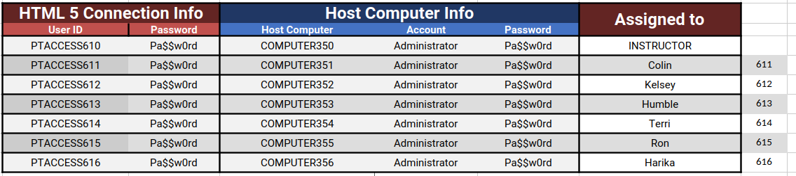

# Lab 1 - Setup

---

## Accessing the VMs

The instructor will walk through the process of logging into your VM environment.

You Machine Assignments are shown here

The documentation on the accessing the VMs is in the VM directory in the main repository.

You can clone the [labs repository](https://github.com/ExgnosisClasses/2505-Labs) into the VM directly or you can open it in a browser in the VM

You may need to pull fresh copies of the lab code during the course.

--- 

## End
