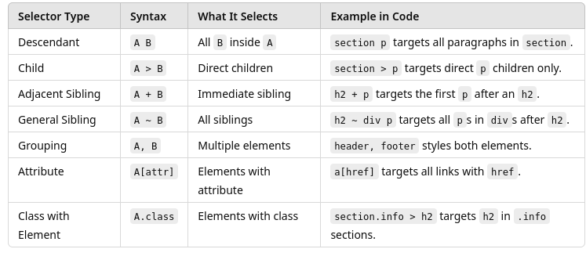

# Lab 4 - CSS

## Part 1: Basic CSS

### Setup

- Create a folder to hold the lab

- Inside the folder, create the following files:
  - index.html: The HTML file.
  - styles.css: The external CSS file.

### Step 1: Write the Basic HTML

Create index.html with the following code: 
- This is in the repository as index1.html

```html
<!DOCTYPE html>
<html lang="en">
<head>
  <meta charset="UTF-8">
  <title>CSS Basics Lab</title>
  <style>
    /* Internal CSS */
    body {
      font-family: Arial, sans-serif;
    }

    h1 {
      color: darkblue;
    }
  </style>
  <link rel="stylesheet" href="styles.css">
</head>
<body>
  <h1>Welcome to the CSS Lab</h1>
  <p>This paragraph demonstrates basic CSS styling.</p>
  <button onclick="alert('Button Clicked!')">Click Me</button>
</body>
</html>
```

- `<style>` tag contains internal CSS.
- `<link>` tag connects the external stylesheet.

- Save and open the file in your browser.
- Verify the heading is dark blue and the text uses Arial font.

### Step 2: Create and Link the External Stylesheet

In styles.css, add the following code:

```css
/* External CSS */
p {
color: green;
font-size: 16px;
}

button {
background-color: orange;
color: white;
padding: 10px;
border: none;
cursor: pointer;
}

button:hover {
background-color: darkorange;
}
```

- Targets `<p>` elements for text styling.
- Styles `<button>` elements with a hover effect.

- Refresh the browser.
- Observe the green paragraph text and styled button.
- Hover over the button to see the background color change.

### Step 3: Add Classes and IDs

Modify index.html: (this is index2.html in the repository)

```html
<p id="intro" class="highlight">This is an important introductory paragraph.</p>
<p class="highlight">This paragraph also uses the highlight class.</p>
```

Update styles.css: This is in styles2.css

```css
#intro {
font-weight: bold;
font-size: 18px;
}

.highlight {
background-color: lightyellow;
border-left: 4px solid gold;
padding: 5px;
}
```

- #intro targets the element with id="intro".
- .highlight targets elements with the highlight class.

- Check the browser to see the differences between the two paragraphs.
- Inspect elements using DevTools and identify applied styles.

Experiment with changing the values of the CSS selectors, like color etc, either in the file or in the devtools

### Step 4: Add a Box and Style It

In index.html add the following (index3.html in the repo)

```html
<div class="box">This is a styled box.</div>
```

In styles.css add the following (styles3.css in the rep0)

```css
.box {
width: 200px;
height: 100px;
background-color: lightblue;
border: 2px solid navy;
padding: 10px;
margin: 20px;
}
```

- width, height: Set the box size.
- padding: Adds space inside the border.
- margin: Adds space outside the box.

- Refresh the page to see the styled box.
- Use DevTools to explore the box model visualization.

### Step 5: Inspect and Modify Styles in Browser

- Right-click on any element and select "Inspect".
- Navigate to the Elements tab to view HTML and associated CSS.
- Modify CSS properties live and observe the changes.

Testing Scenarios:

 - Change text colors and sizes in DevTools.
 - Disable specific CSS rules to see their impact.
 - Test responsiveness by resizing the browser window.

---

## Part 2: Selectors

In this part of the lab, you will
- Use combinator selectors in CSS. 
- Apply descendant, child, adjacent sibling, and general sibling selectors.
- Test and inspect how different selectors affect styling in a web page.

### Lab Setup

- Create a new folder for this section of the lab
- Inside the folder, create:
- index.html – HTML file for structure. (in the lab folder as index4.html)
- styles.css – External CSS file for styles. (int the lab folder as styles4.css)

### Step 1: Create index.html

The following is the content for the index.html file

```html
<!DOCTYPE html>
<html lang="en">
<head>
  <meta charset="UTF-8">
  <title>CSS Selector Combinations Lab</title>
  <link rel="stylesheet" href="styles.css">
</head>
<body>
  <header>
    <h1>Main Heading</h1>
    <nav>
      <ul>
        <li><a href="#">Home</a></li>
        <li><a href="#">About</a></li>
        <li><a href="#">Contact</a></li>
      </ul>
    </nav>
  </header>

  <main>
    <section class="info">
      <h2>Section One</h2>
      <p>This paragraph is inside the first section.</p>
      <div>
        <p>This paragraph is inside a div within the section.</p>
      </div>
    </section>

    <section class="info">
      <h2>Section Two</h2>
      <p>This paragraph is inside the second section.</p>
      <div>
        <p>This paragraph is inside a div within the section.</p>
      </div>
    </section>
  </main>

  <aside>
    <h3>Sidebar</h3>
    <p>This is the sidebar content.</p>
  </aside>

  <footer>
    <p>&copy; 2024 CSS Lab</p>
  </footer>
</body>
</html>
```

### Step 2: Create styles.css

Create the styles.css file with the following content.

```css
/* 1. Descendant Selector (space) */
section p {
color: darkgreen;
}

/* 2. Child Selector (>) */
section > p {
background-color: lightyellow;
}

/* 3. Adjacent Sibling Selector (+) */
h2 + p {
font-style: italic;
color: darkred;
}

/* 4. General Sibling Selector (~) */
h2 ~ div p {
color: blue;
}

/* 5. Grouping Selector (,) */
header, footer {
background-color: lightgray;
padding: 10px;
}

/* 6. Attribute Selector */
a[href] {
color: darkblue;
text-decoration: none;
}

/* 7. Class and ID Selectors Combined */
section.info > h2 {
text-decoration: underline;
}
```

### Selector Types Explained



### Step 3: Testing the Selectors

1. Descendant Selector: Check that all`<p>` inside `<section>` have dark green text.
2. Child Selector: Only the direct child `<p>` under `<section>` has a light yellow background.
3. Adjacent Sibling Selector: The `<p>` immediately after `<h2>` is italic and dark red.
4. General Sibling Selector:`<p>` inside `<div>` following `<h2>` are blue.
5. Grouping Selector: Both `<header>` and `<footer>` have a light gray background.
6. Attribute Selector: All `<a>` tags with a href have dark blue text and no underline.
7. Class and ID Selectors Combined:`<h2>` inside sections with the .info class are underlined.

### Step 4: Testing with DevTools

- Right-click on the webpage and select Inspect.
- Use the Elements tab to view applied CSS rules.
- Toggle CSS properties on and off to observe changes.

## Part 3: CSS Media Queries

### Setup

- Create a folder for the lab
- Inside the folder, create:
- index.html – The HTML file. (In the repository as index5.html)
- styles.css – The external CSS file. (In the repository as styles5.css)

### Step 1: Create index.html

The following is the index.html file that provides a simple structure with a header, content section, box, and footer - ;inked to an external stylesheet styles.css.

```html
<!DOCTYPE html>
<html lang="en">
<head>
  <meta charset="UTF-8">
  <meta name="viewport" content="width=device-width, initial-scale=1.0">
  <title>Media Queries Lab</title>
  <link rel="stylesheet" href="styles.css">
</head>
<body>
  <header>
    <h1>Responsive Design with Media Queries</h1>
  </header>
  <main>
    <section class="content">
      <p>This is some content that will change based on the screen size.</p>
    </section>
    <div class="box">Resizable Box</div>
  </main>
  <footer>
    <p>&copy; 2024 Media Queries Lab</p>
  </footer>
</body>
</html>
```
### Step 2: Create styles.css

Add the following to the styles.css file

Explanation:
- Base styles: Apply to all screen sizes.
- @media (min-width: 600px): Styles apply when the viewport is 600px or wider.
- @media (min-width: 900px): Styles apply when the viewport is 900px or wider.

```css

/* Base Styles */
body {
font-family: Arial, sans-serif;
margin: 0;
padding: 0;
text-align: center;
}

header {
background-color: #4CAF50;
color: white;
padding: 20px;
}

.content {
padding: 20px;
background-color: #f0f0f0;
}

.box {
width: 200px;
height: 200px;
background-color: lightblue;
margin: 20px auto;
}

/* Media Query: For screens wider than 600px */
@media (min-width: 600px) {
.box {
width: 400px;
background-color: lightcoral;
}

.content {
font-size: 18px;
}
}

/* Media Query: For screens wider than 900px */
@media (min-width: 900px) {
.box {
width: 600px;
background-color: lightseagreen;
}

header {
background-color: #333;
}

footer {
font-size: 20px;
}
}

```
### Step 3: Testing Media Queries

Open the web page in your browser.

Resize the browser window and observe the following changes:
- At less than 600px:
  - .box is 200px wide and light blue.
- At 600px or wider: 
  - .box becomes 400px wide and light coral.
  - Text in .content is larger.
- At 900px or wider:
  - .box expands to 600px wide and turns light sea green.
  - Header background changes to dark gray.
  - Footer text size increases.

Use DevTools:
- Right-click the page and select Inspect.
- Click the Toggle device toolbar (phone/tablet icon) to test different devices.
- Observe how media queries activate at different widths.

